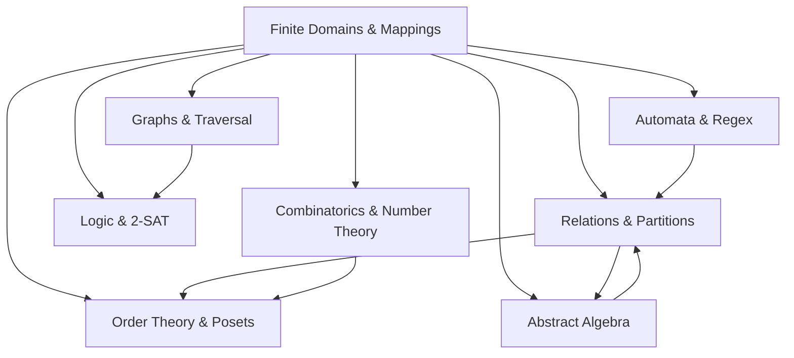
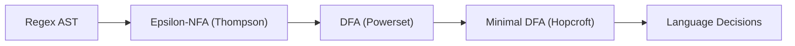

# DiscreteX

[](https://github.com/nijuna/DiscreteX/actions/workflows/ci.yml)
[](https://github.com/nijuna/DiscreteX/releases/tag/v1.0.0)
[](https://en.cppreference.com/w/cpp/20)
[](LICENSE)

DiscreteX is a modern C++20 header-only library for finite discrete mathematics and algorithmic structures. It connects graph algorithms, automata, logic, abstract algebra, order theory, combinatorics, and number theory through shared abstractions rather than isolated modules. Internally, algorithms execute over contiguous index domains for cache-efficient performance; externally, mapped domains preserve ergonomic user-facing semantics. The library has zero third-party dependencies and is fully verified with warnings-clean C++20 builds.

In standard C++, discrete mathematics is fragmented: graph libraries, combinatorics tools, logic engines, and number-theoretic routines rely on conflicting abstractions, bespoke container types, and inconsistent indexing models. DiscreteX establishes constructive, bidirectional bridges between these domains: partially ordered sets naturally produce directed acyclic graphs; propositional valuation spaces are isomorphic to Boolean lattices; 2-SAT satisfiability reduces to strongly connected components in implication graphs; integer and set partitions connect directly with equivalence relations; and divisibility relations form distributive lattices sharing the same order-theoretic algorithms.

---

## Why DiscreteX

- **Unified Mathematical Substratum**: Shared finite-domain abstractions across 9 interconnected discrete mathematics domains.
- **Bridge-Driven Architecture**: Constructive mappings connecting algebraic quotients, automata minimization, implication graphs, and lattice representations.
- **Cache-Locality and Mechanical Sympathy**: Internal execution over dense contiguous index domains ($[0, n)$) with $O(1)$ offsets, paired with boundary mapping (`mapped_domain<T>`).
- **Hardware-Accelerated Bit-Matrices**: Packed 64-bit word storage using CPU bit-scan intrinsics (`std::countr_zero`) to traverse relational fibers in $O(1)$ per non-empty block.
- **Pure C++20 with Zero Dependencies**: Requires only the C++20 standard library; validated by 25 unit test suites and 5 standalone examples with zero compiler warnings under `-Wall -Wextra -Wpedantic -O2`.

---

## Cross-Domain Bridge Architecture



---

## Quick Start

### Fastest First Steps
1. **Orientation**: Read [Start Here: 5-Minute Orientation](docs/start_here.md) for domain tracks and mental models.
2. **Build Examples**: Run `make examples` to compile and execute all 5 curated programs.
3. **Run Test Suites**: Run `make test` to verify all 25 test suites.

### Minimal Example

A complete, self-contained example constructing a weighted directed graph and computing single-source shortest paths:

```cpp
#include <iostream>
#include <discretex/discretex.hpp>

int main() {
    using namespace discretex;

    // Construct a weighted directed graph with 4 vertices: 0, 1, 2, 3
    weighted_directed_graph<int> g(4);
    g.add_edge(0, 1, 3);
    g.add_edge(1, 2, 2);
    g.add_edge(0, 2, 8);
    g.add_edge(2, 3, 1);

    // Compute single-source shortest paths from vertex 0
    auto result = algorithms::dijkstra_shortest_paths(g, 0);
    auto path = algorithms::reconstruct_path(result, 3);

    std::cout << "Distance to vertex 3: " << *result.distance[3] << "\n";
    if (path) {
        std::cout << "Path: ";
        for (std::size_t i = 0; i < path->size(); ++i) {
            std::cout << (*path)[i] << (i + 1 < path->size() ? " -> " : "\n");
        }
    }
    return 0;
}
```

Compile with any standard C++20 compiler:

```bash
g++ -std=c++20 -O2 -Iinclude example.cpp -o example
./example
# Output:
# Distance to vertex 3: 6
# Path: 0 -> 1 -> 2 -> 3
```

---

## Installation and Integration

DiscreteX is header-only and requires ISO C++20.

### Option 1: CMake FetchContent (Recommended)

Incorporate DiscreteX into an existing CMake build with zero manual setup:

```cmake
include(FetchContent)

FetchContent_Declare(
    DiscreteX
    GIT_REPOSITORY https://github.com/nijuna/DiscreteX.git
    GIT_TAG        v1.0.0
)
FetchContent_MakeAvailable(DiscreteX)

add_executable(my_project main.cpp)
target_link_libraries(my_project PRIVATE DiscreteX::DiscreteX)
```

### Option 2: System-Wide Installation

Install headers and CMake package targets:

```bash
cmake -B build -DCMAKE_BUILD_TYPE=Release
cmake --build build
sudo cmake --install build
```

Consume the installed target in downstream `CMakeLists.txt`:

```cmake
find_package(DiscreteX CONFIG REQUIRED)

add_executable(my_project main.cpp)
target_link_libraries(my_project PRIVATE DiscreteX::DiscreteX)
```

### Option 3: Direct Header Inclusion

Clone the repository and add the `include/` directory to your compiler include search path:

```bash
g++ -std=c++20 -O2 -I/path/to/DiscreteX/include main.cpp -o my_project
```

> **Header Organization Note**: For rapid prototyping, include the umbrella header `<discretex/discretex.hpp>`. For production codebases and faster compilation, include granular subsystem headers (e.g., `<discretex/graph/shortest_paths.hpp>`).

---

## Documentation

- **[Start Here: 5-Minute Orientation](docs/start_here.md)**: Onboarding tracks, sandbox verification, and recommended reading paths.
- **[API Quick Reference Index](docs/api_index.md)**: Granular reference of all 34 header files, core classes, algorithms, and asymptotic bounds.
- **[One-Page Project Summary](docs/project_summary.md)**: Compact technical briefing on architecture, domain pipelines, and performance invariants.
- **[Architectural Overview and System Design](docs/architecture.md)**: In-depth analysis of domain identity, bit-matrix storage, concept hierarchy, and bridge proofs.
- **[Theory-to-Code Tour](docs/theory_to_code_tour.md)**: Direct mapping from mathematical theorems to verified C++20 implementations.
- **[Release Notes v1.0.0](docs/release_notes_v1.0.0.md)**: Full v1.0.0 release highlights and API stability guarantees.

---

## Implemented Subsystems (9 Domains)

For complete class references, signatures, and complexities, see the [API Quick Reference Index](docs/api_index.md).

### 1. Core Relations, Partitions & Disjoint Sets (`discretex/core`, `discretex/relation`)
- Dense relations (`dense_relation`) stored as packed 64-bit words with bitwise Warshall transitive closure.
- Fiber iteration (`bit_row_fiber_view`) with hardware `std::countr_zero` bit-skipping.
- Equivalence relations, quotient extraction, and set partition round-trip conversions (`relation_from_partition`).
- Disjoint Set Union (`dsu`) with path compression, union by size ($O(\alpha(n))$), and component tracking.

### 2. Graph Algorithms & Structural Connectivity (`discretex/graph`, `discretex/algorithms`)
- Network flow: Dinic blocking flows, Edmonds-Karp, and Max-Flow Min-Cut duality certification.
- Shortest paths: DAG topological relaxation, Dijkstra (priority queue), Bellman-Ford (negative cycle detection), and Floyd-Warshall all-pairs.
- Minimum spanning trees: Kruskal and Prim algorithms with $|V| - c$ spanning forest invariant verification.
- Bipartite matching: Kuhn and Hopcroft-Karp algorithms, certifying König's Theorem ($|M| = |C|$) and minimum vertex covers.
- Connectivity & Traversals: Tarjan SCC and condensation DAGs, Tarjan biconnectivity (bridges and articulation points), and Hierholzer Eulerian trail synthesis.

### 3. Enumerative Combinatorics & Generators (`discretex/combinatorics`)
- Exact 64-bit counting: factorials, binomial coefficients, Stirling numbers ($S(n, k)$, $|c(n, k)|$), Bell numbers ($B_n$), and Catalan numbers ($C_n$).
- Lexicographical generator views: combinations (`k_subsets_view`), power sets (`power_set_view`), and permutations (`permutations_view`).
- Canonical set partitions via Restricted Growth Strings (RGS) and unrestricted integer partitions ($\lambda \vdash n$).

### 4. Order Theory & Lattices (`discretex/order`)
- Closure-backed partially ordered sets (`poset`) and covering relation extraction $C = \preceq \setminus (\preceq \circ \preceq)$.
- Hasse diagram generation and topological linear extensions.
- Lattice axiom verification: least upper bounds (joins $\vee$) and greatest lower bounds (meets $\wedge$).

### 5. Propositional Logic & 2-SAT Solver (`discretex/logic`)
- AST propositional formula representation supporting operators $\neg, \land, \lor, \to, \leftrightarrow$.
- Truth tables, tautology checking, and normal forms (NNF, CNF, DNF).
- Linear-time Aspvall-Plass-Tarjan 2-SAT solver reducing 2-CNF formulas to implication graphs and SCC topological models.
- Valuation space isomorphism connecting satisfying assignment sets directly with Boolean lattice operations.

### 6. Number Theory & Modular Arithmetic (`discretex/number_theory`)
- Extended Euclidean algorithm, Bézout coefficients, and linear Diophantine equations ($ax + by = c$).
- Dynamic modular rings $\mathbb{Z}/m\mathbb{Z}$ with safe 64-bit inverses and modular exponentiation.
- Deterministic Miller-Rabin primality testing ($n < 2^{64}$), linear sieves, Euler's totient, and general Chinese Remainder Theorem.
- Divisibility lattice bridge certifying that divisor posets $D_n$ form distributive lattices isomorphic to Boolean hypercubes $Q_k$ for square-free $n$.

### 7. Abstract Algebra & Morphisms (`discretex/algebra`)
- Row-major $n \times n$ Cayley tables (`operation_table`) with $O(1)$ cell lookups and callable construction.
- Automated algebraic law checks: associativity, commutativity, identity existence, and inverses.
- Finite monoids, groups, and Boolean algebras with De Morgan duality.
- Normal subgroup verification, left coset partitioning, and quotient group construction ($G/H$) certifying the First Isomorphism Theorem ($G/\ker \phi \cong \text{im } \phi$).

### 8. Automata & Formal Languages (`discretex/automata`)
- Deterministic Finite Automata (`dfa`) with total transition tables and $O(1)$ transitions.
- Nondeterministic Finite Automata (`nfa`) supporting set-valued transitions and $\varepsilon$-closures.
- Structural algorithms: subset construction (determinization), product intersection ($L_1 \cap L_2$), and complementation.
- Hopcroft $O(|\Sigma| \cdot |Q| \log |Q|)$ DFA minimization with equivalence relation certification on partition blocks.
- Thompson regex compiler AST and decision procedures: language emptiness, universality, inclusion, and equivalence.



### 9. Concept Foundations & Zero-Copy Views (`discretex/concepts`, `discretex/relation`)
- C++20 concepts: `concepts::FiniteDomain`, `concepts::Relation`, `concepts::ForwardGraph`, and `concepts::BidirectionalGraph`.
- Zero-copy converse view (`views::transpose`) creating $R^{-1}$ at zero allocation cost.
- Unified BFS engine operating polymorphically across dense bit-matrices, sparse adjacency graphs, and transposed views.

---

## Standalone Examples

DiscreteX provides 5 standalone examples in `examples/` demonstrating core algorithms and cross-domain bridges:

| Example Source | Domains Demonstrated | Key Invariants Verified |
| :--- | :--- | :--- |
| [`examples/shortest_paths.cpp`](examples/shortest_paths.cpp) | Graph Theory | Dijkstra single-source shortest paths, lazy path reconstruction, and Floyd-Warshall all-pairs matrix |
| [`examples/two_sat_solver.cpp`](examples/two_sat_solver.cpp) | Logic, Graph Theory | 2-CNF implication graph, Tarjan SCC decomposition, Aspvall-Plass-Tarjan solver, and model certification |
| [`examples/network_flow_min_cut.cpp`](examples/network_flow_min_cut.cpp) | Graph Theory | Dinic blocking flow, intermediate vertex flow conservation, and Max-Flow Min-Cut duality |
| [`examples/quotient_group_isomorphism.cpp`](examples/quotient_group_isomorphism.cpp) | Abstract Algebra | $S_3$ permutation group, normality checks, coset quotient groups, and First Isomorphism Theorem ($S_3/A_3 \cong \mathbb{Z}_2$) |
| [`examples/regex_to_min_dfa.cpp`](examples/regex_to_min_dfa.cpp) | Automata Theory | Thompson NFA, Powerset DFA, Hopcroft minimization, and formal language decision procedures |

Compile and run all examples with:

```bash
make examples
```

---

## Who This Library Is For

- **Educators**: Teaching discrete mathematics, graph theory, formal languages, or abstract algebra with executable, verified computational models.
- **Researchers**: Prototyping finite algebraic structures, posets, language decisions, and relational models.
- **Systems & Algorithm Engineers**: High-performance graph algorithms, flow networks, 2-SAT solvers, and hardware-accelerated bit-relations with predictable cache behavior and zero dependencies.
- **Advanced Students**: Exploring constructive bridges between discrete mathematical theory and clean ISO C++20 code.

---

## Build and Verification

### Requirements
- ISO C++20 compliant compiler:
  - GCC 11+
  - Clang 13+
  - MSVC 19.29+ (Visual Studio 2019 version 16.11+)
- Build systems: GNU Make or CMake 3.15+

### Build Targets

```bash
# Build and execute all 25 unit test suites and all 5 examples
make

# Execute only unit test suites
make test

# Compile and execute standalone examples
make examples

# Clean all build artifacts
make clean
```

All algorithms, models, and cross-subsystem bridges are compiled with `-std=c++20 -Wall -Wextra -Wpedantic -O2` and pass with 0 warnings.

---

## Repository Structure

```
DiscreteX/
├── .github/
│   └── workflows/
│       └── ci.yml
├── CMakeLists.txt
├── Makefile
├── README.md
├── LICENSE
├── cmake/
│   └── DiscreteXConfig.cmake.in
├── docs/
│   ├── api_index.md
│   ├── architecture.md
│   ├── project_summary.md
│   ├── release_notes_v1.0.0.md
│   ├── start_here.md
│   └── theory_to_code_tour.md
├── examples/
│   ├── network_flow_min_cut.cpp
│   ├── quotient_group_isomorphism.cpp
│   ├── regex_to_min_dfa.cpp
│   ├── shortest_paths.cpp
│   └── two_sat_solver.cpp
├── include/
│   └── discretex/
│       ├── discretex.hpp
│       ├── algebra/
│       ├── algorithms/
│       ├── automata/
│       ├── combinatorics/
│       ├── concepts/
│       ├── core/
│       ├── graph/
│       ├── logic/
│       ├── number_theory/
│       ├── order/
│       └── relation/
└── tests/
    ├── test_main.cpp
    └── test_runner.hpp
```

---

## License

DiscreteX is released under the MIT License.
