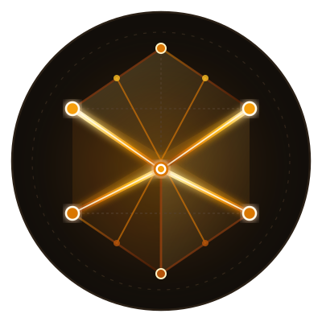
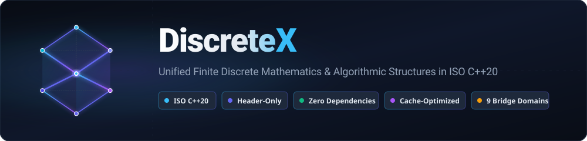
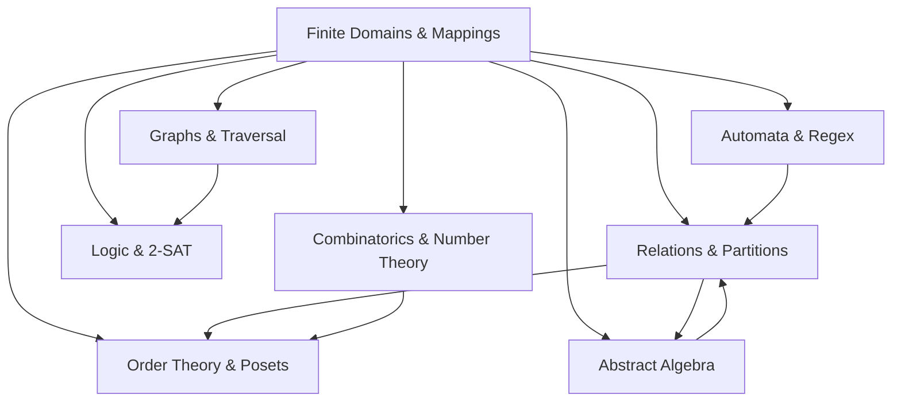

<div align="center">
  <a href="#discretex">
    
  </a>
  <br />
  <br />
  
</div>

<p align="center">
  <a href="https://github.com/nijuna/DiscreteX/actions/workflows/ci.yml"></a>
  <a href="https://github.com/nijuna/DiscreteX/releases/tag/v1.0.0"></a>
  <a href="https://en.cppreference.com/w/cpp/20"></a>
  <a href="LICENSE"></a>
  
  
  
</p>

<p align="center">
  <strong>A modern, header-only ISO C++20 library establishing unified, constructive bridges across finite discrete mathematics and algorithmic structures.</strong>
</p>

---

## Overview

Discrete mathematics forms the bedrock of computer science, underpinning compilers, formal verification, cryptographic protocols, database engines, constraint satisfaction, and network optimization. In the contemporary C++ ecosystem, however, computational implementations of these concepts are fragmented: graph libraries isolate pointer-linked nodes, combinatorics routines manipulate ad-hoc raw arrays, logic engines remain disconnected from valuation lattices, and automata minimizers operate in isolation from algebraic quotient structures.

**DiscreteX** eliminates this fragmentation. It provides a cohesive, header-only ISO C++20 foundation where discrete mathematical structures interoperate through **constructive, bidirectional bridges**. Partially ordered sets directly generate directed acyclic graphs; 2-SAT formulas reduce in linear time to strongly connected components in directed implication graphs; valuation spaces form Boolean lattices; divisor sets yield distributive lattices; and normal subgroup coset partitions construct certified quotient groups verifying the First Isomorphism Theorem.

Internally, algorithms execute over contiguous integer index sets ($\Omega = \{0, 1, \dots, n-1\}$) for optimal L1/L2 cache locality and hardware bit-scan acceleration (`std::countr_zero`). Externally, `mapped_domain<T>` provides ergonomic mappings for semantic user types. DiscreteX has **zero third-party dependencies** and compiles cleanly under `-Wall -Wextra -Wpedantic -O2`.

---

## Architectural Contrast

| Dimension | Conventional Fragmented Ecosystem | DiscreteX Unified Bridge Architecture |
| :--- | :--- | :--- |
| **Domain Interoperability** | Siloed packages; graph nodes incompatible with logic ASTs or posets | Shared finite index domains ($\Omega = [0, n)$); canonical transforms between lattices, graphs, and automata |
| **Memory & Cache Layout** | Pointer chasing across dynamic node allocations and hash tables | Contiguous vector indices with $O(1)$ offsets and packed 64-bit word storage |
| **Relational Traversal** | Iterating lists or sparse adjacency matrices | Hardware-accelerated bit-scan intrinsics (`std::countr_zero`), skipping 64 non-edges in $O(1)$ CPU cycles |
| **Constraint Satisfaction** | Separate DPLL/CDCL solvers with opaque internal representations | Aspvall-Plass-Tarjan linear reduction: 2-CNF $\to$ Implication Digraph $\to$ Tarjan SCC $\to$ Model Assignment |
| **Language Automata** | Opaque state machines or isolated regex engines | Complete Kleene & Myhill-Nerode pipeline: Regex AST $\to$ Thompson $\varepsilon$-NFA $\to$ Powerset DFA $\to$ Hopcroft Minimal DFA |
| **Abstract Algebra** | Abstract template hierarchies with severe compile-time overhead | Concrete Cayley tables, automated group axiom checks, coset partitions, and quotient group isomorphisms |
| **External Dependencies** | Boost, Eigen, or bespoke external utilities | **Zero third-party dependencies**; standard ISO C++20 headers only |

---

## Cross-Domain Bridge Architecture

DiscreteX is structured as a network of constructive mathematical bridges connecting 9 core domains:


```mermaid
flowchart TD
    A["Finite Domains & Mappings"] --> B["Relations & Partitions"]
    A --> C["Graphs & Traversal"]
    A --> D["Logic & 2-SAT"]
    A --> E["Automata & Regex"]
    A --> F["Order Theory & Posets"]
    A --> G["Abstract Algebra"]
    A --> H["Combinatorics & Number Theory"]

    B --> F
    B --> G
    C --> D
    E --> B
    H --> F
    G --> B
```

---

## Quick Start

### Fastest First Steps
1. **Orientation**: Read [Start Here: 5-Minute Orientation](docs/start_here.md) for domain tracks and mental models.
2. **Build Examples**: Run `make examples` to compile and execute all 5 curated showcase programs.
3. **Run Test Suites**: Run `make test` to verify all 25 unit test suites.

### Snippet 1: Direct Graph Traversal & Shortest Paths
Construct a weighted directed graph and compute single-source shortest paths with lazy path reconstruction:

```cpp
#include <iostream>
#include <discretex/discretex.hpp>

int main() {
    using namespace discretex;

    // Construct a weighted directed graph with 4 vertices: 0, 1, 2, 3
    weighted_directed_graph<int> g(4);
    g.add_edge(0, 1, 3);
    g.add_edge(1, 2, 2);
    g.add_edge(0, 2, 8);
    g.add_edge(2, 3, 1);

    // Compute single-source shortest paths from vertex 0
    auto result = algorithms::dijkstra_shortest_paths(g, 0);
    auto path = algorithms::reconstruct_path(result, 3);

    std::cout << "Distance to vertex 3: " << *result.distance[3] << "\n";
    if (path) {
        std::cout << "Path: ";
        for (std::size_t i = 0; i < path->size(); ++i) {
            std::cout << (*path)[i] << (i + 1 < path->size() ? " -> " : "\n");
        }
    }
    return 0;
}
```

Compile and run:
```bash
g++ -std=c++20 -O2 -Iinclude example1.cpp -o example1 && ./example1
# Output:
# Distance to vertex 3: 6
# Path: 0 -> 1 -> 2 -> 3
```

### Snippet 2: The Bridge Showcase (2-SAT to Implication Graph to Model)
Construct a 2-CNF formula, build its directed implication graph, and solve satisfiability via Tarjan SCC decomposition:

```cpp
#include <iostream>
#include <discretex/discretex.hpp>

int main() {
    using namespace discretex::logic;

    // Formula: (x0 v x1) ^ (~x1 v x2) ^ (~x2 v ~x0) ^ (x0 v ~x2)
    formula_2cnf f(3);
    f.add_clause(pos(0), pos(1));
    f.add_clause(neg(1), pos(2));
    f.add_clause(neg(2), neg(0));
    f.add_clause(pos(0), neg(2));

    // Linear-time Aspvall-Plass-Tarjan solver
    auto res = solve_2sat(f);
    if (res.satisfiable) {
        std::cout << "Formula is SAT! Valid model:\n";
        for (std::size_t i = 0; i < res.assignment.size(); ++i) {
            std::cout << "  x" << i << " = " << (res.assignment[i] ? "true" : "false") << "\n";
        }
    }
    return 0;
}
```

Compile and run:
```bash
g++ -std=c++20 -O2 -Iinclude example2.cpp -o example2 && ./example2
# Output:
# Formula is SAT! Valid model:
#   x0 = true
#   x1 = false
#   x2 = false
```

---

## Mechanical Sympathy & Hardware Acceleration

DiscreteX is engineered with deep cache awareness and hardware mechanical sympathy:

1. **Two-Tier Domain Identity Model**:
   - `index_domain`: Core algorithms execute strictly over contiguous integer domains $\Omega = [0, n)$. Array accesses require zero pointer chasing, zero hash computations, and guarantee predictable stride-1 prefetching into L1/L2 cache lines.
   - `mapped_domain<T>`: Arbitrary user types (strings, structs, custom IDs) are mapped bijectively to contiguous indices once at the system boundary.
2. **Dense 64-Bit Packed Bit-Matrices (`dense_relation`)**:
   - Binary relations are packed into 64-bit words (`std::uint64_t`).
   - Fiber traversals via `bit_row_fiber_view` utilize hardware bit-scan intrinsics (`std::countr_zero`), skipping 64 non-edges in a single CPU cycle.
   - Bitwise Warshall transitive closure executes in-place in $O(n^3 / 64)$ time, delivering near-microsecond performance for dense relational graphs.
3. **Zero-Allocation Converses (`views::transpose`)**:
   - Relational converses and digraph transpositions ($R^{-1}$) are constructed at zero allocation cost by swapping index accessors at compile time.

---

## Asymptotic Complexity & Feature Summary

| Domain | Key Algorithm / Structure | Time Complexity | Space Complexity | Theoretical Invariant Certified |
| :--- | :--- | :--- | :--- | :--- |
| **Relations** | Warshall Transitive Closure | $O(n^3 / 64)$ | $O(n^2 / 64)$ words | Strict idempotence: $R^+ \circ R^+ = R^+$ |
| **Relations** | Disjoint Set Union (DSU) | $O(\alpha(n))$ amortized | $O(n)$ | Path compression + union-by-size |
| **Graphs** | Tarjan SCC Decomposition | $O(V + E)$ | $O(V)$ | Condensation graph is a valid DAG |
| **Graphs** | Dinic Layered Blocking Flow | $O(V^2 E)$ | $O(V + E)$ | Max-Flow Min-Cut duality; Kirchhoff flow conservation |
| **Graphs** | Hopcroft-Karp Bipartite Matching | $O(E\sqrt{V})$ | $O(V + E)$ | König's Duality Theorem: $\|M\| = \|C\|$ |
| **Graphs** | Dijkstra Shortest Paths | $O((V + E) \log V)$ | $O(V)$ | Non-negative weight metric optimality |
| **Graphs** | Tarjan Biconnectivity | $O(V + E)$ | $O(V)$ | Low-link bridge and articulation point detection |
| **Logic** | Aspvall-Plass-Tarjan 2-SAT | $O(V + E)$ | $O(V + E)$ | $f \in \text{SAT} \iff \forall x_i, \text{scc}(x_i) \ne \text{scc}(\neg x_i)$ |
| **Automata** | Hopcroft DFA Minimization | $O(\|\Sigma\| \cdot \|Q\| \log \|Q\|)$ | $O(\|\Sigma\| \cdot \|Q\|)$ | Canonical Myhill-Nerode quotient equivalence classes |
| **Automata** | Thompson Regex Compilation | $O(m)$ AST nodes | $O(m)$ states | Exact structural language preservation $L(R) = L(N)$ |
| **Algebra** | Normal Subgroup Quotient | $O(\|G\|^2)$ | $O(\|G\|)$ | Coset multiplication $(aH)(bH) = (ab)H \iff H \trianglelefteq G$ |
| **Order** | Poset Covering Relation | $O(n^3 / 64)$ | $O(n^2 / 64)$ | Transitive reduction $C = \preceq \setminus (\preceq \circ \preceq)$ |
| **Number Theory**| Deterministic Miller-Rabin | $O(k \log^3 n)$ | $O(1)$ | Primality testing for all $n < 2^{64}$ |

---

## Implemented Subsystems (9 Domains)

For complete class references, function signatures, and details, see the [API Quick Reference Index](docs/api_index.md).

### 1. Core Relations, Partitions & Disjoint Sets (`discretex/core`, `discretex/relation`)
- Packed 64-bit bit-matrix binary relations (`dense_relation`).
- Hardware-accelerated fiber iteration (`bit_row_fiber_view`) with `std::countr_zero`.
- Equivalence relations, quotient extraction, and round-trip set partition conversion (`relation_from_partition`).
- Disjoint Set Union (`dsu`) with path compression and size-ranked trees.

### 2. Graph Algorithms & Structural Connectivity (`discretex/graph`, `discretex/algorithms`)
- Network flow: Dinic blocking flows, Edmonds-Karp, and Max-Flow Min-Cut duality certification.
- Shortest paths: DAG topological relaxation, Dijkstra (priority queue), Bellman-Ford (negative cycle detection), and Floyd-Warshall all-pairs.
- Minimum spanning trees: Kruskal and Prim algorithms with $\|V\| - c$ spanning forest invariant verification.
- Bipartite matching: Kuhn and Hopcroft-Karp algorithms, certifying König's Theorem ($\|M\| = \|C\|$) and minimum vertex covers.
- Connectivity & Traversals: Tarjan SCC and condensation DAGs, Tarjan biconnectivity (bridges and articulation points), and Hierholzer Eulerian trail synthesis.

### 3. Enumerative Combinatorics & Generators (`discretex/combinatorics`)
- Exact 64-bit counting: factorials, binomial coefficients, Stirling numbers ($S(n, k)$, $\|c(n, k)\|$), Bell numbers ($B_n$), and Catalan numbers ($C_n$).
- Lexicographical generator views: combinations (`k_subsets_view`), power sets (`power_set_view`), and permutations (`permutations_view`).
- Canonical set partitions via Restricted Growth Strings (RGS) and unrestricted integer partitions ($\lambda \vdash n$).

### 4. Order Theory & Lattices (`discretex/order`)
- Closure-backed partially ordered sets (`poset`) and covering relation extraction $C = \preceq \setminus (\preceq \circ \preceq)$.
- Hasse diagram generation and topological linear extensions.
- Lattice axiom verification: least upper bounds (joins $\vee$) and greatest lower bounds (meets $\wedge$).

### 5. Propositional Logic & 2-SAT Solver (`discretex/logic`)
- AST propositional formula representation supporting operators $\neg, \land, \lor, \to, \leftrightarrow$.
- Truth tables, tautology checking, and normal forms (NNF, CNF, DNF).
- Linear-time Aspvall-Plass-Tarjan 2-SAT solver reducing 2-CNF formulas to implication graphs and SCC topological models.
- Valuation space isomorphism connecting satisfying assignment sets directly with Boolean lattice operations.

### 6. Number Theory & Modular Arithmetic (`discretex/number_theory`)
- Extended Euclidean algorithm, Bézout coefficients, and linear Diophantine equations ($ax + by = c$).
- Dynamic modular rings $\mathbb{Z}/m\mathbb{Z}$ with safe 64-bit inverses and modular exponentiation.
- Deterministic Miller-Rabin primality testing ($n < 2^{64}$), linear sieves, Euler's totient, and general Chinese Remainder Theorem.
- Divisibility lattice bridge certifying that divisor posets $D_n$ form distributive lattices isomorphic to Boolean hypercubes $Q_k$ for square-free $n$.

### 7. Abstract Algebra & Morphisms (`discretex/algebra`)
- Row-major $n \times n$ Cayley tables (`operation_table`) with $O(1)$ cell lookups and callable construction.
- Automated algebraic law checks: associativity, commutativity, identity existence, and inverses.
- Finite monoids, groups, and Boolean algebras with De Morgan duality.
- Normal subgroup verification, left coset partitioning, and quotient group construction ($G/H$) certifying the First Isomorphism Theorem ($G/\ker \phi \cong \text{im } \phi$).

### 8. Automata & Formal Languages (`discretex/automata`)
- Deterministic Finite Automata (`dfa`) with total transition tables and $O(1)$ transitions.
- Nondeterministic Finite Automata (`nfa`) supporting set-valued transitions and $\varepsilon$-closures.
- Structural algorithms: subset construction (determinization), product intersection ($L_1 \cap L_2$), and complementation.
- Hopcroft $O(\|\Sigma\| \cdot \|Q\| \log \|Q\|)$ DFA minimization with equivalence relation certification on partition blocks.
- Thompson regex compiler AST and decision procedures: language emptiness, universality, inclusion, and equivalence.

### 9. Concept Foundations & Zero-Copy Views (`discretex/concepts`, `discretex/relation`)
- C++20 concepts: `concepts::FiniteDomain`, `concepts::Relation`, `concepts::ForwardGraph`, and `concepts::BidirectionalGraph`.
- Zero-copy converse view (`views::transpose`) creating $R^{-1}$ at zero allocation cost.
- Unified BFS engine operating polymorphically across dense bit-matrices, sparse adjacency graphs, and transposed views.

---

## Standalone Showcase Examples

DiscreteX provides 5 standalone examples in [`examples/`](examples/) demonstrating core algorithms and cross-domain bridges:

| Example Source | Domains Demonstrated | Key Invariants Verified |
| :--- | :--- | :--- |
| [`examples/shortest_paths.cpp`](examples/shortest_paths.cpp) | Graph Theory | Dijkstra single-source shortest paths, lazy path reconstruction, and Floyd-Warshall all-pairs matrix |
| [`examples/two_sat_solver.cpp`](examples/two_sat_solver.cpp) | Logic, Graph Theory | 2-CNF implication graph, Tarjan SCC decomposition, Aspvall-Plass-Tarjan solver, and model certification |
| [`examples/network_flow_min_cut.cpp`](examples/network_flow_min_cut.cpp) | Graph Theory | Dinic blocking flow, intermediate vertex flow conservation, and Max-Flow Min-Cut duality |
| [`examples/quotient_group_isomorphism.cpp`](examples/quotient_group_isomorphism.cpp) | Abstract Algebra | $S_3$ permutation group, normality checks, coset quotient groups, and First Isomorphism Theorem ($S_3/A_3 \cong \mathbb{Z}_2$) |
| [`examples/regex_to_min_dfa.cpp`](examples/regex_to_min_dfa.cpp) | Automata Theory | Thompson NFA, Powerset DFA, Hopcroft minimization, and formal language decision procedures |

Compile and run all examples with:
```bash
make examples
```

---

## Installation and Integration

DiscreteX is header-only and requires an ISO C++20 compliant compiler.

### Option 1: CMake FetchContent (Recommended)
Add DiscreteX directly to an existing CMake build with zero manual installation:

```cmake
include(FetchContent)

FetchContent_Declare(
    DiscreteX
    GIT_REPOSITORY https://github.com/nijuna/DiscreteX.git
    GIT_TAG        v1.0.0
)
FetchContent_MakeAvailable(DiscreteX)

add_executable(my_project main.cpp)
target_link_libraries(my_project PRIVATE DiscreteX::DiscreteX)
```

### Option 2: System-Wide CMake Installation
Install the headers and CMake configuration targets locally:

```bash
cmake -B build -DCMAKE_BUILD_TYPE=Release
cmake --build build
sudo cmake --install build
```

Consume the installed package in downstream `CMakeLists.txt`:

```cmake
find_package(DiscreteX CONFIG REQUIRED)

add_executable(my_project main.cpp)
target_link_libraries(my_project PRIVATE DiscreteX::DiscreteX)
```

### Option 3: Direct Header Inclusion
Clone the repository and add the `include/` directory to your compiler include path:

```bash
g++ -std=c++20 -O2 -I/path/to/DiscreteX/include main.cpp -o my_project
```

> **Header Organization Note**: For rapid prototyping, include the umbrella header `<discretex/discretex.hpp>`. For production codebases and faster compilation, include granular subsystem headers (e.g., `<discretex/graph/shortest_paths.hpp>`).

---

## Documentation Index

- **[Start Here: 5-Minute Orientation](docs/start_here.md)**: Onboarding tracks, mental models, and quick setup.
- **[API Quick Reference Index](docs/api_index.md)**: Granular reference of all 34 header files, classes, and signatures.
- **[One-Page Technical Summary](docs/project_summary.md)**: Compact briefing on architecture, domain pipelines, and performance invariants.
- **[Architectural Overview and System Design](docs/architecture.md)**: In-depth analysis of domain identity, bit-matrix storage, and bridge proofs.
- **[Theory-to-Code Tour](docs/theory_to_code_tour.md)**: Direct mapping from mathematical theorems to verified C++20 implementations.
- **[Release Notes v1.0.0](docs/release_notes_v1.0.0.md)**: Full v1.0.0 release highlights and API stability guarantees.

---

## Build and Verification

### Requirements
- ISO C++20 compliant compiler:
  - GCC 11+
  - Clang 13+
  - MSVC 19.29+ (Visual Studio 2019 version 16.11+)
- Build systems: GNU Make or CMake 3.15+

### Build Targets

```bash
# Build and execute all 25 unit test suites and all 5 examples
make

# Execute only unit test suites
make test

# Compile and execute standalone examples
make examples

# Clean all build artifacts
make clean
```

All algorithms, models, and cross-subsystem bridges compile under `-std=c++20 -Wall -Wextra -Wpedantic -O2` and pass with 0 warnings.

---

## Repository Structure

```
DiscreteX/
├── .github/
│   └── workflows/
│       └── ci.yml
├── CMakeLists.txt
├── Makefile
├── README.md
├── LICENSE
├── cmake/
│   └── DiscreteXConfig.cmake.in
├── docs/
│   ├── assets/
│   │   ├── discretex-banner.svg
│   │   └── discretex-logo.svg
│   ├── api_index.md
│   ├── architecture.md
│   ├── project_summary.md
│   ├── release_notes_v1.0.0.md
│   ├── start_here.md
│   └── theory_to_code_tour.md
├── examples/
│   ├── network_flow_min_cut.cpp
│   ├── quotient_group_isomorphism.cpp
│   ├── regex_to_min_dfa.cpp
│   ├── shortest_paths.cpp
│   └── two_sat_solver.cpp
├── include/
│   └── discretex/
│       ├── discretex.hpp
│       ├── algebra/
│       ├── algorithms/
│       ├── automata/
│       ├── combinatorics/
│       ├── concepts/
│       ├── core/
│       ├── graph/
│       ├── logic/
│       ├── number_theory/
│       ├── order/
│       └── relation/
└── tests/
    └── test_main.cpp
```

---

## License

DiscreteX is released under the [MIT License](LICENSE).
