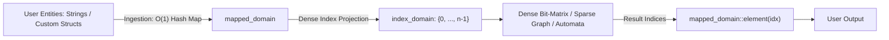
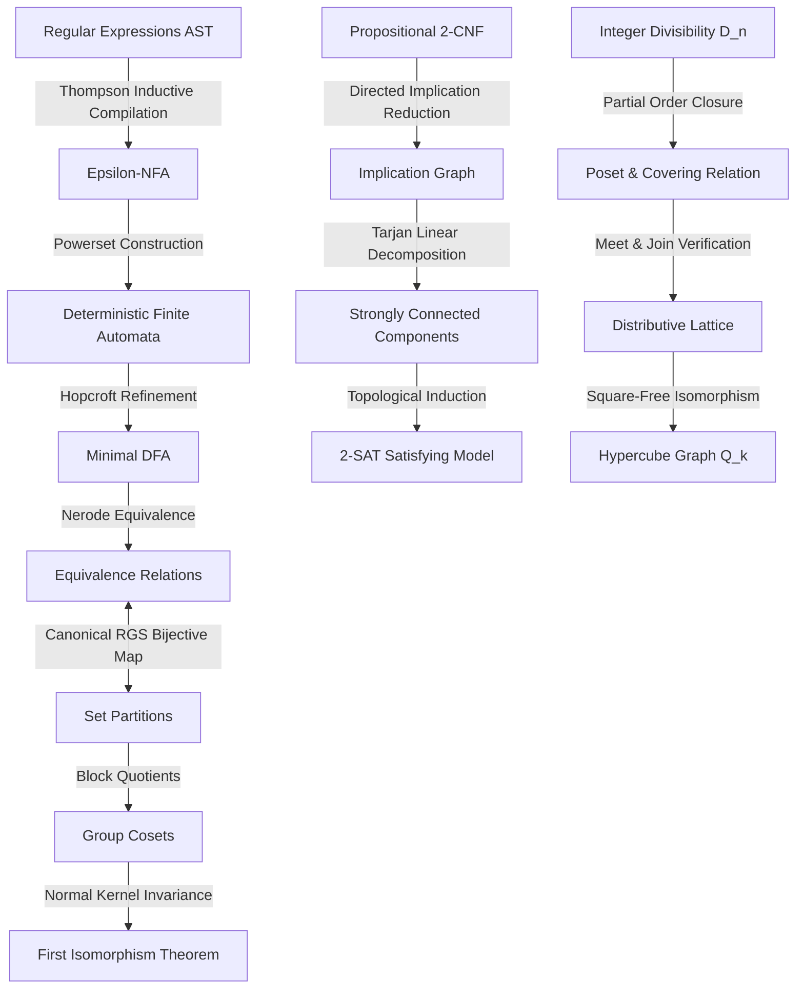

# DiscreteX: Architectural Overview and System Design

## 1. Executive Summary

Discrete mathematics is foundational to computer science, encompassing finite algebra, graph theory, combinatorics, formal languages, propositional logic, and order theory. In software engineering and scientific computing, however, implementations of these domains are typically fragmented across disparate libraries or ad-hoc competitive programming routines. Graph libraries frequently impose rigid node abstractions; combinatorics routines operate on unstructured arrays; logic engines isolate valuation spaces; and formal language automata are treated separately from algebraic quotient systems.

**DiscreteX** resolves this fragmentation by providing a unified, mathematically coherent, header-only ISO C++20 library. The library treats discrete mathematics not as an arbitrary collection of algorithms, but as a deeply interconnected structural continuum. In DiscreteX:
- Partially ordered sets and distributive lattices share the exact same underlying traversal and closure engines as directed acyclic graphs.
- Propositional 2-SAT constraint satisfaction reduces directly to strongly connected component decomposition on directed implication graphs.
- Set partitions canonically induce dense mathematical equivalence relations, which in turn define the quotient partition spaces utilized during Hopcroft DFA state minimization and group-theoretic coset decomposition.
- Divisibility relations on finite integers induce distributive lattices isomorphic to Boolean algebras and hypercube graphs.
- The First Isomorphism Theorem for Groups is verified constructively through explicit coset partitions and kernel-image homomorphic bijections.

By anchoring core algorithmic execution on contiguous index domains while offering zero-overhead semantic mapping at ingestion boundaries, DiscreteX achieves both formal mathematical rigor and cache-optimal execution efficiency.

---

## 2. The Two-Tier Domain System

A central challenge in mathematical library design is the tension between semantic flexibility (e.g., vertices named by strings, custom structs, or coordinate pairs) and low-level memory locality. Associative maps (`std::unordered_map`, `std::map`) introduce pointer indirection, cache misses, and dynamic memory allocation overhead that severely degrade high-performance inner loops.

DiscreteX resolves this tension through an explicit two-tier domain architecture:

### 2.1 Dense Execution Identity (`index_domain`)
The inner algorithmic core operates exclusively over [`index_domain(n)`](file:///media/Shared/RAIG-Records/03-Interests/Projects/DiscreteX/include/discretex/core/domain.hpp), representing contiguous integers:
$$\Omega = \{0, 1, \dots, n-1\}$$
- All state arrays, predecessor maps, bitsets, and distance tables are indexed in $O(1)$ time via primitive array offsets.
- Storage is densely packed and cache-friendly, maximizing CPU L1/L2 data cache line utilization.
- Memory layouts are strictly deterministic and contiguous.

### 2.2 Semantic Ingestion Boundary (`mapped_domain<T>`)
For applications requiring arbitrary element types $T$, DiscreteX provides [`mapped_domain<T>`](file:///media/Shared/RAIG-Records/03-Interests/Projects/DiscreteX/include/discretex/core/domain.hpp):
- Encapsulates bidirectional mappings: forward translation $T \to \text{std::size_t}$ via hash indexing, and reverse retrieval $\text{std::size_t} \to \text{const } T\&$ via contiguous vector storage.
- Elements are mapped exactly once at system boundaries (e.g., during graph ingestion or user query).
- Core mathematical operations (such as shortest paths, network flows, or group quotients) execute over dense indices without bearing associative lookup costs.



---

## 3. Storage Engines and Bit-Level Hardware Acceleration

DiscreteX abstracts binary relations and graphs into two complementary storage architectures governed by C++20 concepts:

### 3.1 Dense Bit-Matrix (`dense_relation`)
Binary relations $R \subseteq \Omega \times \Omega$ are stored as flat vectors of 64-bit unsigned words (`std::uint64_t`) in [`dense_relation`](file:///media/Shared/RAIG-Records/03-Interests/Projects/DiscreteX/include/discretex/relation/dense_relation.hpp). For a domain of size $n$:
- Total memory consumption is exactly $\lceil n / 64 \rceil \times n$ words.
- **Bit-Row Fiber Views (`bit_row_fiber_view`)**: Iterating over outgoing edges of vertex $u$ uses hardware bit-scan operations (`std::countr_zero` via CPU instructions such as `TZCNT` or `BSF`). Entire blocks of 64 non-edges are skipped in $O(1)$ CPU cycles.
- **Warshall Transitive Closure**: The reflexive-transitive closure $R^*$ is computed in-place using bitwise OR operations across 64-bit words, executing the inner loop in $O(n^3 / 64)$ time.

### 3.2 Sparse Adjacency Structures (`forward_adjacency_graph`, `bidirectional_adjacency_graph`)
For sparse graphs where $|E| \ll |V|^2$, DiscreteX provides [`sparse_graph.hpp`](file:///media/Shared/RAIG-Records/03-Interests/Projects/DiscreteX/include/discretex/graph/sparse_graph.hpp):
- Neighbor lists are maintained in sorted `std::vector<std::size_t>` blocks.
- Neighborhood iteration yields zero-overhead `std::span<const std::size_t>`.
- Edge presence queries execute in $O(\log \text{deg}(u))$ time via binary search (`std::lower_bound`).
- Dual forward and backward neighbor arrays enable constant-time transpose queries without extra allocations.

### 3.3 Zero-Copy Converses (`views::transpose`)
For any relation or graph satisfying [`concepts::BidirectionalRelation`](file:///media/Shared/RAIG-Records/03-Interests/Projects/DiscreteX/include/discretex/concepts/relation.hpp), the converse relation:
$$R^{-1} = \{(v, u) \mid (u, v) \in R\}$$
is constructed via [`views::transpose`](file:///media/Shared/RAIG-Records/03-Interests/Projects/DiscreteX/include/discretex/relation/transpose_view.hpp) as a zero-copy wrapper. The wrapper exchanges the forward accessor `out_neighbors(u)` with the backward accessor `in_neighbors(u)` with zero memory allocation.

---

## 4. The Unified Cross-Subsystem Bridge Architecture

The defining characteristic of DiscreteX is its **bridge-driven architecture**. Subsystems do not merely coexist; they explicitly transform into one another across mathematical boundaries.



### 4.1 Automata, Equivalence Relations, and Algebra
Automata state minimization is traditionally taught as an isolated table-filling algorithm. DiscreteX models minimization as the algebraic quotient of a regular language under the Myhill-Nerode equivalence relation:
1. **Regular Expressions ([`automata/regex.hpp`](file:///media/Shared/RAIG-Records/03-Interests/Projects/DiscreteX/include/discretex/automata/regex.hpp))**: Formulated as recursive algebraic expression trees with overloaded operator syntax (`+` for concatenation, `|` for alternation, `star()` for Kleene closure).
2. **Thompson Compilation (`thompson_construction`)**: Inductively compiles regex AST fragments into $\varepsilon$-NFAs with single-entry, single-exit invariants.
3. **Powerset Determinization (`subset_construction`)**: Transforms the $\varepsilon$-NFA into an equivalent total DFA using dense 64-bit bitset state clusters ([`state_set`](file:///media/Shared/RAIG-Records/03-Interests/Projects/DiscreteX/include/discretex/automata/algorithms.hpp)).
4. **Hopcroft Minimization (`minimize_dfa`)**: Refines the partition of states in $O(|\Sigma| \cdot |Q| \log |Q|)$ time.
5. **The Bridge**: The resulting partition blocks are exposed directly as a mathematical equivalence relation via `relation_from_partition`, connecting automata theory directly to the core partition and relational quotient subsystem.

### 4.2 Logic, Implication Graphs, and Component Condensation
The 2-SAT satisfiability problem bridges propositional logic and structural graph theory:
1. **2-CNF Representation ([`logic/two_sat.hpp`](file:///media/Shared/RAIG-Records/03-Interests/Projects/DiscreteX/include/discretex/logic/two_sat.hpp))**: Formulas are stored as sets of 2-clauses $(a \lor b)$.
2. **Implication Graph Reduction**: Each clause $(a \lor b)$ is expanded into two directed edges: $(\neg a \to b)$ and $(\neg b \to a)$ over a literal domain of size $2n$.
3. **Tarjan Linear-Time SCC ([`algorithms/tarjan_scc.hpp`](file:///media/Shared/RAIG-Records/03-Interests/Projects/DiscreteX/include/discretex/algorithms/tarjan_scc.hpp))**: Computes the strongly connected components of the implication graph in $O(V + E)$ time.
4. **Aspvall-Plass-Tarjan Satisfiability Certification**:
   $$\phi \in \text{SAT} \iff \forall x_i, \; \text{scc}(x_i) \ne \text{scc}(\neg x_i)$$
5. **Model Extraction**: If satisfiable, a truth assignment is extracted in topological order of the condensation DAG:
   $$x_i = [\text{scc}(x_i) > \text{scc}(\neg x_i)]$$

### 4.3 Number Theory, Order Theory, and Distributive Lattices
Divisibility on positive integers induces order-theoretic lattices:
1. **Divisor Poset ($D_n$)**: For any integer $n$, the divisors $\{d \mid n\}$ ordered by divisibility ($u \preceq v \iff u \mid v$) form a finite partially ordered set ([`order/poset.hpp`](file:///media/Shared/RAIG-Records/03-Interests/Projects/DiscreteX/include/discretex/order/poset.hpp)).
2. **Covering Relations and Hasse Diagrams**: The transitive reduction $C = \preceq \setminus (\preceq \circ \preceq)$ yields the minimal Hasse diagram without transitive shortcuts.
3. **Lattice Meet and Join**: For any two divisors $u, v \in D_n$:
   $$u \wedge v = \gcd(u, v), \quad u \vee v = \text{lcm}(u, v)$$
4. **Hypercube Isomorphism**: For square-free integers $n = p_1 p_2 \dots p_k$, the divisor lattice $D_n$ is proven constructively to be isomorphic to the Boolean lattice $B_k = \mathcal{P}(\{0, \dots, k-1\})$ and the hypercube graph $Q_k$.

### 4.4 Abstract Algebra, Cosets, and the First Isomorphism Theorem
Finite groups and their quotients are realized as computational structures:
1. **Cayley Tables ([`algebra/operation_table.hpp`](file:///media/Shared/RAIG-Records/03-Interests/Projects/DiscreteX/include/discretex/algebra/operation_table.hpp))**: Ingestion of arbitrary binary operations with $O(1)$ Cayley multiplication.
2. **Normal Subgroups (`is_normal_subgroup`)**: Tests closure, invertibility, and conjugation invariance:
   $$\forall g \in G, \forall h \in H: \quad g \cdot h \cdot g^{-1} \in H$$
3. **Coset Partitioning (`coset_partition`)**: Partitions elements of $G$ into disjoint cosets $gH$.
4. **Quotient Group Construction (`quotient_group`)**: Builds $G / H$ as a first-class `finite_group<index_domain>` with verified operation $(aH)(bH) = (ab)H$.
5. **First Isomorphism Theorem ([`algebra/quotient.hpp`](file:///media/Shared/RAIG-Records/03-Interests/Projects/DiscreteX/include/discretex/algebra/quotient.hpp))**: Given a group homomorphism $f: G \to G'$:
   $$G / \ker(f) \cong \text{im}(f)$$
   DiscreteX computes $\ker(f)$, forms $G / \ker(f)$, and algorithmically certifies the bijective, operation-preserving isomorphism onto $\text{im}(f)$.

---

## 5. Algorithmic Complexity and Correctness Invariants

DiscreteX adheres strictly to optimal theoretical complexity bounds:

| Algorithm / Problem | Header File | Time Complexity | Space Complexity | Theoretical Invariants |
| :--- | :--- | :--- | :--- | :--- |
| **Transitive Closure** | [`relation/dense_relation.hpp`](file:///media/Shared/RAIG-Records/03-Interests/Projects/DiscreteX/include/discretex/relation/dense_relation.hpp) | $O(n^3 / 64)$ | $O(n^2 / 64)$ | Reflexive-transitive fixpoint |
| **SCC Decomposition** | [`algorithms/tarjan_scc.hpp`](file:///media/Shared/RAIG-Records/03-Interests/Projects/DiscreteX/include/discretex/algorithms/tarjan_scc.hpp) | $O(V + E)$ | $O(V)$ | Topological ordering of condensation |
| **Biconnectivity / Bridges** | [`algorithms/connectivity.hpp`](file:///media/Shared/RAIG-Records/03-Interests/Projects/DiscreteX/include/discretex/algorithms/connectivity.hpp) | $O(V + E)$ | $O(V)$ | Tarjan low-link articulation points |
| **Eulerian Circuit / Trail**| [`algorithms/eulerian.hpp`](file:///media/Shared/RAIG-Records/03-Interests/Projects/DiscreteX/include/discretex/algorithms/eulerian.hpp) | $O(V + E)$ | $O(V + E)$ | Hierholzer degree / balance criteria |
| **DFA Minimization** | [`automata/algorithms.hpp`](file:///media/Shared/RAIG-Records/03-Interests/Projects/DiscreteX/include/discretex/automata/algorithms.hpp) | $O(|\Sigma| \cdot |Q| \log |Q|)$ | $O(|Q| \cdot |\Sigma|)$ | Hopcroft partition refinement |
| **Regex Compilation** | [`automata/regex.hpp`](file:///media/Shared/RAIG-Records/03-Interests/Projects/DiscreteX/include/discretex/automata/regex.hpp) | $O(|R|)$ | $O(|R|)$ | Thompson inductive composition |
| **Max Flow (Dinic)** | [`algorithms/network_flow.hpp`](file:///media/Shared/RAIG-Records/03-Interests/Projects/DiscreteX/include/discretex/algorithms/network_flow.hpp) | $O(V^2 E)$ | $O(V + E)$ | Layered blocking flows; $O(E \sqrt{V})$ unit networks |
| **Min-Cut Verification** | [`algorithms/network_flow.hpp`](file:///media/Shared/RAIG-Records/03-Interests/Projects/DiscreteX/include/discretex/algorithms/network_flow.hpp) | $O(V + E)$ | $O(V)$ | Max-Flow Min-Cut duality |
| **Bipartite Matching** | [`algorithms/bipartite_matching.hpp`](file:///media/Shared/RAIG-Records/03-Interests/Projects/DiscreteX/include/discretex/algorithms/bipartite_matching.hpp) | $O(E \sqrt{V})$ | $O(V)$ | Hopcroft-Karp; König $|M| = |C|$ |
| **2-SAT Satisfiability** | [`logic/two_sat.hpp`](file:///media/Shared/RAIG-Records/03-Interests/Projects/DiscreteX/include/discretex/logic/two_sat.hpp) | $O(V + E)$ | $O(V + E)$ | Aspvall-Plass-Tarjan linear model |
| **Single-Source Shortest Paths** | [`algorithms/shortest_paths.hpp`](file:///media/Shared/RAIG-Records/03-Interests/Projects/DiscreteX/include/discretex/algorithms/shortest_paths.hpp) | $O((V+E)\log V)$ | $O(V)$ | Dijkstra min-priority queue |
| **All-Pairs Shortest Paths** | [`algorithms/shortest_paths.hpp`](file:///media/Shared/RAIG-Records/03-Interests/Projects/DiscreteX/include/discretex/algorithms/shortest_paths.hpp) | $O(V^3)$ | $O(V^2)$ | Floyd-Warshall with negative cycle detection |
| **Minimum Spanning Tree** | [`algorithms/minimum_spanning_tree.hpp`](file:///media/Shared/RAIG-Records/03-Interests/Projects/DiscreteX/include/discretex/algorithms/minimum_spanning_tree.hpp) | $O(E \log E)$ | $O(V + E)$ | Kruskal DSU / Prim priority queue |

---

## 6. Modern C++20 Idioms and Mechanical Sympathy

DiscreteX is engineered specifically for ISO C++20:

1. **Strict Concepts**: All relations and graphs are constrained using concepts ([`concepts::Relation`](file:///media/Shared/RAIG-Records/03-Interests/Projects/DiscreteX/include/discretex/concepts/relation.hpp), [`concepts::ForwardGraph`](file:///media/Shared/RAIG-Records/03-Interests/Projects/DiscreteX/include/discretex/concepts/graph.hpp), [`concepts::BidirectionalGraph`](file:///media/Shared/RAIG-Records/03-Interests/Projects/DiscreteX/include/discretex/concepts/graph.hpp)). Interfaces demand only what algorithms strictly require.
2. **Hardware Intrinsic Acceleration**: `std::countr_zero` is utilized in `bit_row_fiber_view` to map 64-bit word transitions directly to assembly instructions (`TZCNT`), eliminating redundant memory traversal.
3. **Structured Non-Allocating Views**: Graph reversals ([`views::transpose`](file:///media/Shared/RAIG-Records/03-Interests/Projects/DiscreteX/include/discretex/relation/transpose_view.hpp)) and generator sequences ([`k_subsets_view`](file:///media/Shared/RAIG-Records/03-Interests/Projects/DiscreteX/include/discretex/combinatorics/subsets.hpp), [`permutations_view`](file:///media/Shared/RAIG-Records/03-Interests/Projects/DiscreteX/include/discretex/combinatorics/permutations.hpp), [`power_set_view`](file:///media/Shared/RAIG-Records/03-Interests/Projects/DiscreteX/include/discretex/combinatorics/subsets.hpp)) generate elements lazily without intermediate vector heap allocations.
4. **Three-Way Comparison (`operator<=>`)**: Dense state sets ([`state_set`](file:///media/Shared/RAIG-Records/03-Interests/Projects/DiscreteX/include/discretex/automata/algorithms.hpp)) and mathematical tuples leverage compiler-synthesized three-way comparisons for deterministic ordering in balanced search trees and sorting routines.
5. **Zero External Dependencies**: DiscreteX requires only the C++ standard library. It compiles with 0 warnings under `-std=c++20 -Wall -Wextra -Wpedantic -O2`.

---

## 7. Downstream Adoption and Integration

DiscreteX is distributed under the permissive MIT License. Downstream projects consume DiscreteX through standard modern CMake targets:

```cmake
# Option 1: CMake FetchContent
include(FetchContent)
FetchContent_Declare(
    DiscreteX
    GIT_REPOSITORY https://github.com/nijuna/DiscreteX.git
    GIT_TAG        v1.0.0
)
FetchContent_MakeAvailable(DiscreteX)

# Option 2: Pre-installed Package
find_package(DiscreteX CONFIG REQUIRED)

# Linkage
target_link_libraries(downstream_project PRIVATE DiscreteX::DiscreteX)
```

The exported target `DiscreteX::DiscreteX` automatically configures C++20 language standards and include directory paths.
